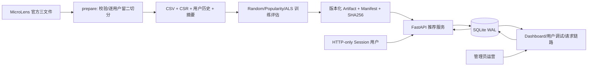

# 系统设计

## 总体架构



`recsys/` 负责官方数据、切分、baseline、ALS、评估和不可变 artifact；`app/` 负责身份、Feed 编排、在线反馈、Dashboard 与运营。SQLite 是在线状态权威源，模型目录只读加载。单进程设计适合笔试 Demo；扩容时可将事件库迁到 PostgreSQL、缓存迁到 Redis，接口契约无需改变。

## 离线数据与防泄漏

官方 pairs 只有每个用户内的交互顺序，没有可信绝对时间。每个用户去重后至少 3 条：最后一条为 test、倒数第二条为 validation、其余为 train，满足 `max(train_position) < validation_position < test_position`。模型选择只看 validation；选定 64 因子后以 train+validation 重训，test 只使用一次。

输出包括三份 split CSV/CSR、完整交互、内容元数据、训练用户历史、映射和摘要。ALS 将观测交互视为隐式正反馈，未观测项是未知而非显式负样本，因此没有伪造负标签。Random/Popularity/ALS 都过滤已见内容，Coverage 分母固定为完整 19,220 内容目录；另报 warm-target 切片，避免隐藏冷内容不可召回的问题。

## 在线召回、排序和混排

```text
在线内容 -> 已曝光/不感兴趣过滤
  personalized: 官方 source_user_id -> ALS Top-N -> 实时反馈桶加权重排
  popular: train_interactions + likes + views
  explore: 全局低曝光优先 + 用户稳定散列
-> 有效期/范围匹配的运营强推
-> 最终 online 权威过滤 + 去重
-> request + exposures + impression 同事务落库
```

三个 Demo 用户映射到不同 MicroLens 用户，ALS 返回业务 item ID。点击权重 `0.5`、喜欢权重 `1.5` 累计到 `item_id % 5` 的轻量实时画像桶，所以下一轮个性化排序可立即变化；这是 MVP 在线重排，不冒充重新训练 ALS。新用户或未知 source ID 走训练集热门回退。模型调用抛错或返回空候选时，`FeedService` 降级到确定性热门流，并在 request 和响应中记录 `fallback_reason`。

## 一致性与可观测性

- 每次 Feed 生成 UUID `request_id`，先写 recommendation request，再写有位置、来源、分数、解释的 exposures 和自动 impression。
- 客户端 click/like/not_interested 必须引用当前用户拥有的 exposure；`event_id` 唯一，同 payload 重试返回 duplicate，冲突 payload 返回 409。
- SQLite 启用 foreign keys、WAL、NORMAL synchronous；事件与画像版本在同一事务提交。
- Dashboard 从数据库实时聚合用户、活跃用户、请求、曝光、点击、CTR、点赞、流占比和热门内容；请求链路可回查 exposure 与 event。
- 每个请求记录模型版本、Feed、页码、延迟和 fallback 原因。模型表记录数据版本、训练时间、指标和发布状态。

## 模型发布

训练先写入新的 `artifacts/<model_version>/`，生成模型、CSR、映射、Popularity、metrics、Badcase、checksums 和 manifest；全部成功后才原子替换小型 `artifacts/latest.json` 指针，训练失败不会覆盖现有版本。服务启动时只加载该指针。大二进制不进入 Git，私有 Release 提供 bundle 和 SHA256；源码保留完整重训路径。

## 权限与运营优先级

- 密码用 Argon2 哈希；应用登录态为签名 HttpOnly、SameSite=Lax Session。普通用户身份只从服务端 session 读取，不能提交任意 user ID。
- 所有 `/api/admin/*` 在服务端校验 admin 角色；SQLAdmin 另用独立管理员 cookie，所有视图禁用新增、修改、删除。
- 强推支持全体、指定用户名/本地用户 ID、指定 Feed，以及开始/结束时间。强推只在第一页注入并保留来源/原因。
- 下线是最终权威：候选生成后再检查 `Item.status`；离线内容无法新建强推、不能出现在任何 Feed，直接内容 API 返回 404。恢复只恢复可候选状态，不绕过正常排序。每次操作记录管理员、原因、前后状态和时间。

## 失败恢复与已知问题

| 故障 | 当前行为 | 后续扩展 |
|---|---|---|
| 官方文件缺失/格式错 | prepare 明确失败，不覆盖版本指针 | 下载重试与 schema 告警 |
| 训练中断 | 新目录不发布，旧 `latest.json` 保持 | 异步任务状态机 |
| 模型缺失/调用失败 | deterministic/popularity fallback，可查原因 | 双版本热加载与熔断 |
| 候选不足/已看过多 | 热门/探索补位；返回空态而非白屏 | cursor 与多路候选池 |
| SQLite 不可用 | 请求失败并返回 HTTP 错误，不伪造数据 | PostgreSQL 主从与队列 |
| 并发部署 | 当前面向单进程 Demo | Redis 配置缓存、分布式锁 |

最大数据风险是官方序列缺少绝对时间，不能分析真实日历时间衰减或跨用户同时段漂移；文档和产物均明确把 timestamp 标记为合成值。
